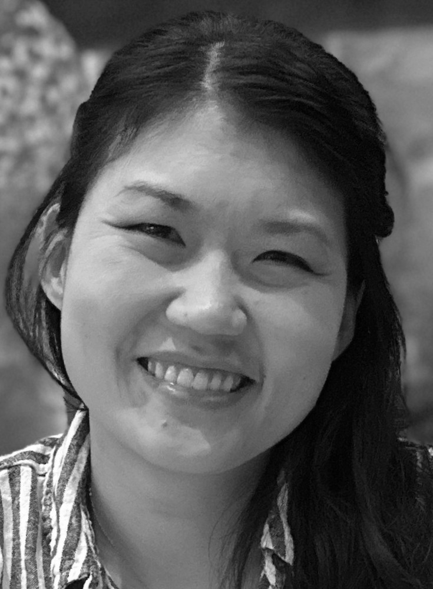
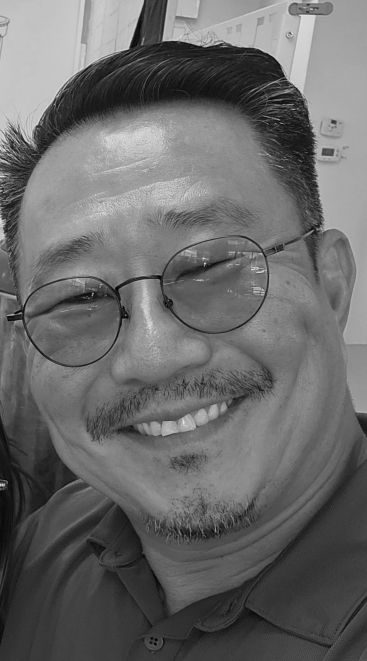
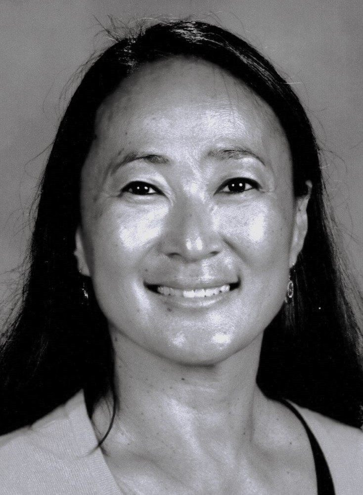

## About Korean Adoptees Together

**Korean Adoptees Together, Inc.** is a 501(c)(3) organization founded in Jacksonville, Florida. We hope to inspire and support Korean adoptees through meet-ups and events throughout the year.  

Our mission is to foster communication and support among Korean adoptees, provide a safe haven for facilitating connections, embrace the diversity of experiences and perspectives, and celebrate a strong sense of identity as individuals and as a community.  

Our vision is to provide more opportunities and access for Korean adoptees to build relationships and participate in meaningful experiences throughout the Southeastern U.S.  

Social media has brought many of us together virtually, and we hope to strengthen those bonds through more face-to-face gatherings.  

We look forward to collaborating with other organizations that support adoptees and the broader Korean American community. Join us as we come together to celebrate and connect with our fellow Korean adoptees.

---

## Who We Are

Meet our board members:

{: .board-photo }
**Amy Gilbert** – President  
Amy was born with the name Kim, Hui Ra, in Seoul, South Korea. She is the author of
*Becoming Korean: A Memoir,* which shares the story of her adoption as a child into a white American family and her discovery and reconnection with her Korean culture and birth family. In addition to being the President of Korean Adoptees Together, Inc., she is also the Vice President of the Mayor's Asian American Advisory Board and the Vice President of the NE Florida Korean Association.

{: .board-photo }
**Jessica Daiello** – Vice President  
Jessica was born in Daegu, South Korea and was adopted when she was 3 months old, living in Florida for much of her life (Gulf Coast area, Orlando, and currently Jacksonville.)  She only started to connect with other Korean Adoptees fairly recently while starting to learn and embrace her heritage, but has found a group of amazing Korean Adoptees who understand and support each other. Meeting them launched a new journey of self-discovery and kindled a desire to help support those who are on the same adventure.

{: .board-photo }
**Curtis Bai** – Treasurer  
Curtis was adopted at 2 years old from Seoul, South Korea.  He grew up in La Quinta California and moved to Jacksonville with the US Navy at 19 years old.  Curtis began his journey with the Jacksonville based Korean Adoptee (KAD) group in 2017 and participated in the Mosaic tour in 2025 for a birth search with his adoption agency.  He was unsuccessful in locating any birth family, but is excited to help others in their birth search journey.  Curtis is excited to connect with everyone and bring more KADs together to experience the supportive, loving community that many may not yet know exists.

{: .board-photo }
**Aylia Kellam** – Secretary  
Aylia was born in Daegu, South Korea, and adopted at 5 months old to a family in Virginia Beach,
Virginia, where she grew up. She moved to Jacksonville, Florida in 1998 with her husband and has three
kids. She is a middle school science and gifted teacher in Jacksonville and loves nature, the outdoors,
cooking and eating Korean food, and traveling. She discovered the local Korean adoptee group in
November 2024 at their first conference and has been excited since then to meet and connect with
many other Korean adoptees. She is looking forward to building relationships and helping with events
within the KAD community.
<!-- Add more board members below following the same format -->

